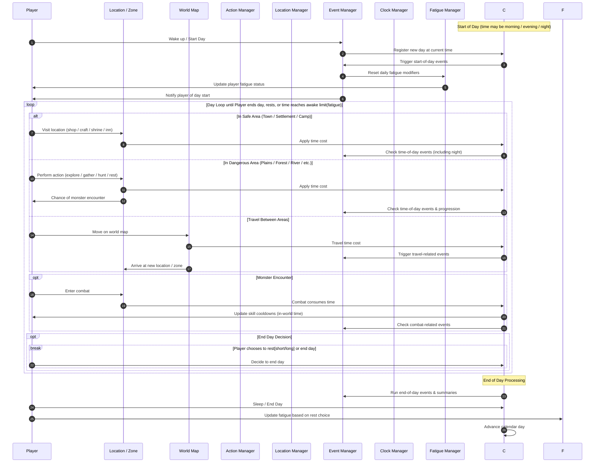

```mermaid
sequenceDiagram
    autonumber
    participant P as Player
    participant L as Location / Zone
    participant W as World Map
    participant AM as Action Manager
    participant LM as Location Manager
    participant EM as Event Manager
    participant CM as Clock Manager
    participant FM as Fatigue Manager

    Note over C: Start of Day (time may be morning / evening / night)

    P->>EM: Wake up / Start Day
    EM->>C: Register new day at current time
    C->>EM: Trigger start-of-day events
    EM->>FM: Reset daily fatigue modifiers
    FM->>P: Update player fatigue status
    EM->>P: Notify player of day start

    loop Day Loop until Player ends day, rests, or time reaches awake limit(fatigue)
        alt In Safe Area (Town / Settlement / Camp)
            P->>L: Visit location (shop / craft / shrine / inn)
            L->>C: Apply time cost
            C->>EM: Check time-of-day events (including night)
        else In Dangerous Area (Plains / Forest / River / etc.)
            P->>L: Perform action (explore / gather / hunt / rest)
            L->>C: Apply time cost
            L->>P: Chance of monster encounter
            C->>EM: Check time-of-day events & progression
        else Travel Between Areas
            P->>W: Move on world map
            W->>C: Travel time cost
            C->>EM: Trigger travel-related events
            W->>L: Arrive at new location / zone
        end

        opt Monster Encounter
            P->>L: Enter combat
            L->>C: Combat consumes time
            C->>P: Update skill cooldowns (in-world time)
            C->>EM: Check combat-related events
        end

        opt End Day Decision
            break Player chooses to rest[short/long] or end day
                P->>C: Decide to end day
            end
        end
    end

    Note over C: End of Day Processing
    C->>EM: Run end-of-day events & summaries
    P->>C: Sleep / End Day
    P->>F: Update fatigue based on rest choice
    C->>C: Advance calendar day
    
```