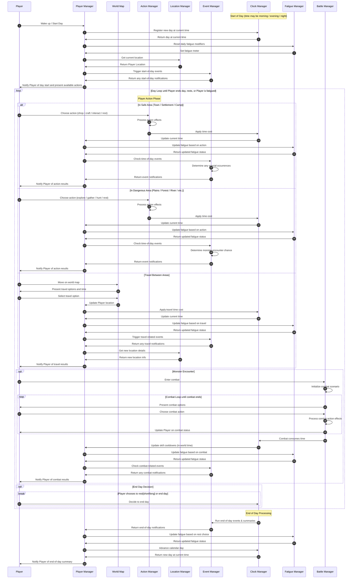

```mermaid
sequenceDiagram
    autonumber
    participant P as Player
    participant PM as Player Manager
    participant W as World Map
    participant AM as Action Manager
    participant LM as Location Manager
    participant EM as Event Manager
    participant CM as Clock Manager
    participant FM as Fatigue Manager
    participant BM as Battle Manager

    Note over CM: Start of Day (time may be morning / evening / night)

    P->>PM: Wake up / Start Day
    PM->>CM: Register new day at current time
    CM->>PM: Return day at current time
    PM->>FM: Reset daily fatigue modifiers
    FM->>PM: Set fatigue meter
    PM->>LM: Get current location
    LM->>PM: Return Player Location
    PM->>EM: Trigger start-of-day events
    EM->>PM: Return any start-of-day notifications
    PM->>P: Notify Player of day start and present available actions

    loop Day Loop until Player ends day, rests, or Player is fatigued
        Note over AM: Player Action Phase
        alt In Safe Area (Town / Settlement / Camp)
            P->>AM: Choose action (shop / craft / interact / rest)
            AM->>AM: Process action effects
            AM->>CM: Apply time cost
            CM->>PM: Update current time
            PM->>FM: Update fatigue based on action
            FM->>PM: Return updated fatigue status
            PM->>EM: Check time-of-day events
            EM->>EM: Determine any special occurrences
            EM->>PM: Return event notifications
            PM->>P: Notify Player of action results
        else In Dangerous Area (Plains / Forest / River / etc.)
            P->>AM: Choose action (explore / gather / hunt / rest)
            AM->>AM: Process action effects
            AM->>CM: Apply time cost
            CM->>PM: Update current time
            PM->>FM: Update fatigue based on action
            FM->>PM: Return updated fatigue status
            PM->>EM: Check time-of-day events
            EM->>EM: Determine monster encounter chance
            EM->>PM: Return event notifications
            PM->>P: Notify Player of action results
        else Travel Between Areas
            P->>W: Move on world map
            W->>P: Present travel options and time
            P->>W: Select travel option
            W->>PM: Update Player location
            PM->>CM: Apply travel time cost
            CM->>PM: Update current time
            PM->>FM: Update fatigue based on travel
            FM->>PM: Return updated fatigue status
            PM->>EM: Trigger travel-related events
            EM->>PM: Return any travel notifications
            PM->>LM: Get new location details
            LM->>PM: Return new location info
            PM->>P: Notify Player of travel results
        end

        opt Monster Encounter
            P->>BM: Enter combat
            BM->>BM: Initialize combat scenario
            loop Combat Loop until combat ends
                BM->>P: Present combat options
                P->>BM: Choose combat action
                BM->>BM: Process combat action effects
                BM->>P: Update Player on combat status
            end
            BM->>CM: Combat consumes time
            CM->>PM: Update skill cooldowns (in-world time)
            PM->>FM: Update fatigue based on combat
            FM->>PM: Return updated fatigue status
            PM->>EM: Check combat-related events
            EM->>PM: Return any combat notifications
            PM->>P: Notify Player of combat results
        end

        opt End Day Decision
            break Player chooses to rest[short/long] or end day
                P->>CM: Decide to end day
            end
        end
    end

    Note over CM: End of Day Processing
    CM->>EM: Run end-of-day events & summaries
    EM->>PM: Return end-of-day notifications
    PM->>FM: Update fatigue based on rest choice
    FM->>PM: Return updated fatigue status
    PM->>CM: Advance calendar day
    CM->>PM: Return new day at current time
    PM->>P: Notify Player of end-of-day summary
    
```