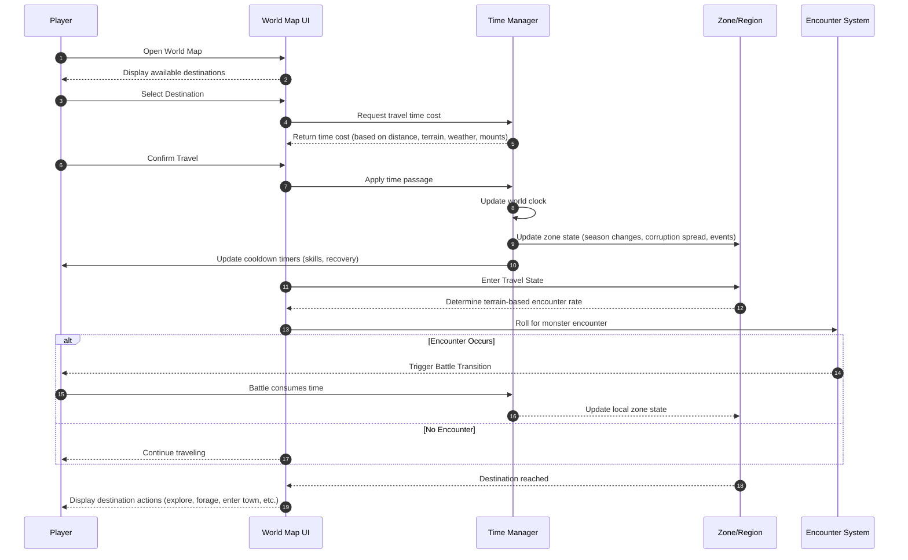

```mermaid
sequenceDiagram
    autonumber

    participant P as Player
    participant UI as World Map UI
    participant TM as Time Manager
    participant Z as Zone/Region
    participant E as Encounter System

    %% Opening the World Map
    P->>UI: Open World Map
    UI-->>P: Display available destinations

    %% Player Chooses Destination
    P->>UI: Select Destination
    UI->>TM: Request travel time cost
    TM-->>UI: Return time cost (based on distance, terrain, weather, mounts)

    %% Player Confirms Travel
    P->>UI: Confirm Travel
    UI->>TM: Apply time passage

    %% Time Manager Handles Global Updates
    TM->>TM: Update world clock
    TM->>Z: Update zone state (season changes, corruption spread, events)
    TM->>P: Update cooldown timers (skills, recovery)

    %% Travel Phase
    UI->>Z: Enter Travel State
    Z-->>UI: Determine terrain-based encounter rate

    %% Possible Encounter Roll
    UI->>E: Roll for monster encounter
    alt Encounter Occurs
        E-->>P: Trigger Battle Transition
        P->>TM: Battle consumes time
        TM-->>Z: Update local zone state
    else No Encounter
        UI-->>P: Continue traveling
    end

    %% Arrival
    Z-->>UI: Destination reached
    UI-->>P: Display destination actions (explore, forage, enter town, etc.)
```